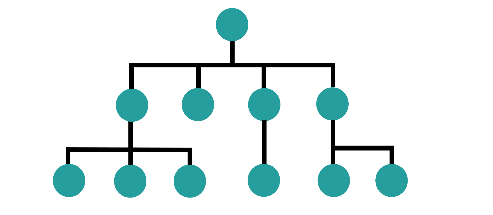
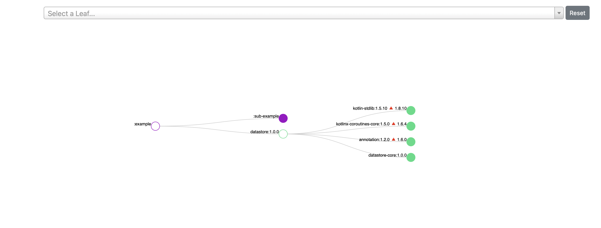
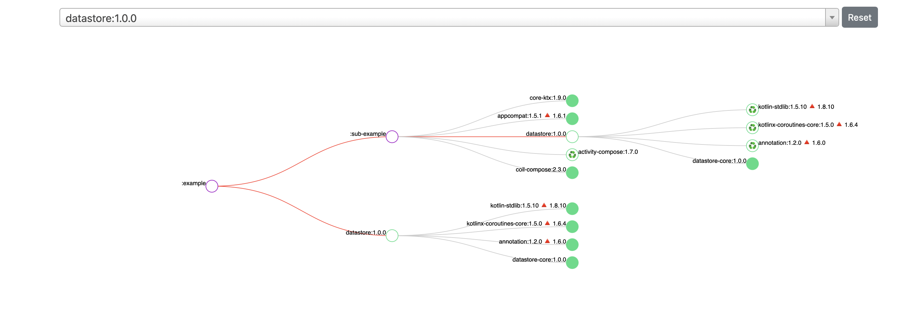

<div align="center">



# ui-dependency-plugin

A simple Gradle plugin for Android that helps you visualize your project's dependencies in an interactive and friendly way.

</div>

---

## 📚 Table of Contents

- [Quick Start](#-quick-start)
- [What does it do?](#️-what-does-it-do)
- [Configuration](#-configuration)
- [Contributing](#-contributing)
- [License](#-license)

---

## 🚀 Quick Start

1. **Add the plugin to your build:**

```gradle
plugins {
    // your application or library plugin
    id("ui.dependency.plugin") version "x.y.z"
}
```

2. **Sync your project.**

3. **Generate the dependency report:**

```sh
./gradlew <your_project>:showUiDependencies
```

4. **Open the generated HTML report:**

After running the task, check the output for a file path like:

```
> Task :<your_project>:showUiDependencies
See the UI Dependencies report at:
===============================================================================================================
                              X
                    +-------------------+
                    X                   X
               +---------+         +---------+
               X         X         X         X
             +----+    +----+    +----+    +----+
             X    X    X    X    X    X    X    X
            +--+ +--+ +--+ +--+ +--+ +--+ +--+ +--+
            X  X X  X X  X X  X X  X X  X X  X X  X


file:///Users/<user>/Documents/ui-dependency-plugin/example/build/ui-dependencies-plugin/index-example.html
```
Open this file in your browser to interactively explore your project's dependency graph!

> [!TIP]
> Some examples of web report:






---

## ⚙️ What does it do?

- Generates an interactive visualization of your project's dependencies.
- Allows filtering of specific dependencies for a cleaner view.
- Provides customization of node and link colors.

---

## 🛠️ Configuration

Customize the plugin using the `uiTreeExtension` block in your `build.gradle`:

```gradle
uiTreeExtension {
    // Filter specific dependencies
    constraints = { group, artifact, version ->
        group == "androidx.datastore"
        && artifact == "datastore-core"
    }

    // Customize styles
    with(style) {
        projectNodeColor = "#FF0000"
        dependencyNodeColor = "#3DDC84"
        linkStrokeColor = "#CCC"
    }
}
```

---

## 🤝 Contributing

Found a bug or have an idea?
[Open an issue](https://github.com/LuizTM/UiDependencyPlugin/issues) or submit a pull request!

---

## 📜 License

Copyright (C) 2025 LuizTM

Licensed under the [Apache License, Version 2.0](LICENSE).

---

**Happy coding!** 🎉
